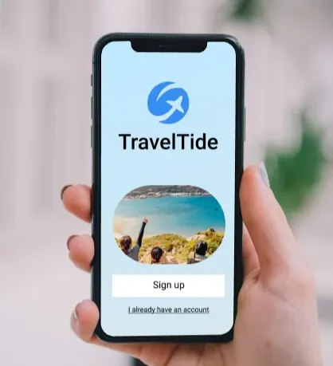
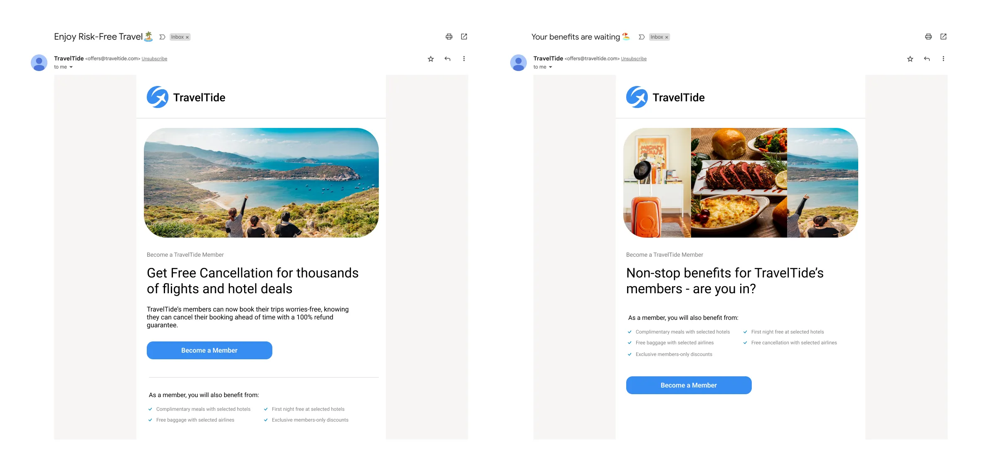

# Career Hub 🚀

A data analysis project for **TravelTide** to help build better customer rewards programs.

## What's This?

We analyze customer data to find out which travel perks different customers like most (like free cancellations or lounge access).

## What We Do

1. **Explore Data** - Look at customer booking patterns
2. **Find Patterns** - See which perks different groups prefer
3. **Group Customers** - Create segments for targeted marketing

## Tools We Use

- Python (Pandas, NumPy)
- Data Visualization (Matplotlib, Seaborn)
- Git & GitHub

## About the Data

Uses TravelTide's internal customer data.

*For learning/portfolio purposes*