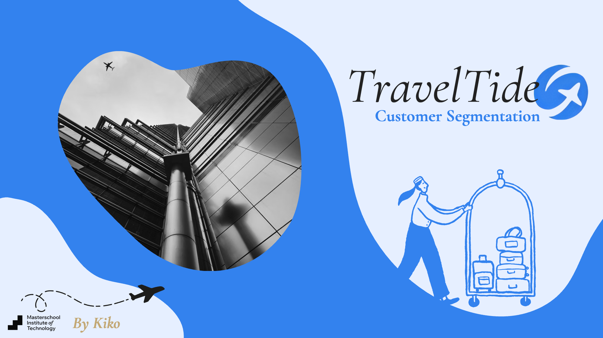
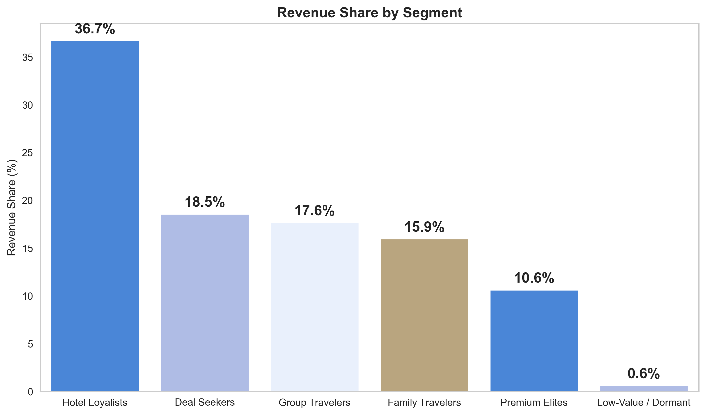
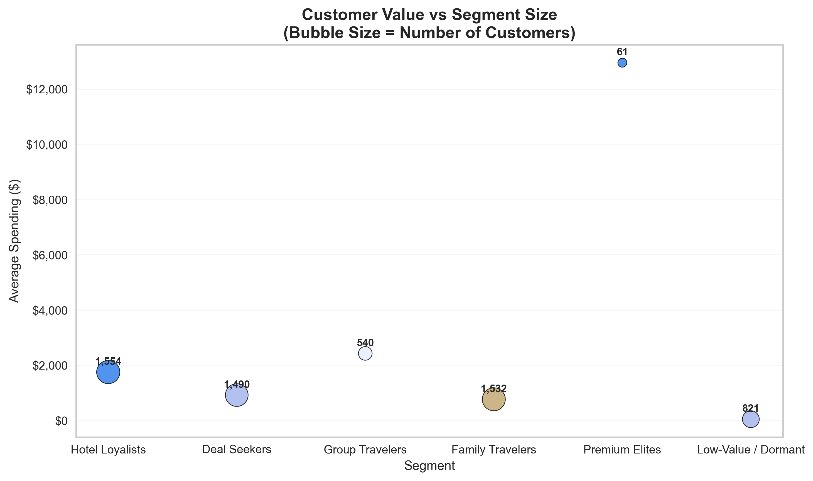
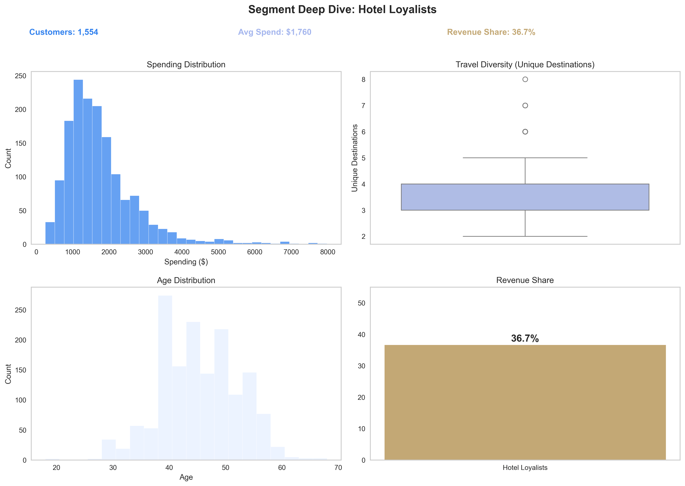

# 🏆 TravelTide Rewards

This project segments TravelTide customers into clear personas to enable targeted allocation of personalized perks.

---

## 🎯 Objectives

- **Segmentation:** Identify customer groups based on booking behavior and engagement.
- **Personalization:** Assign **one single** tailored perk per persona.
- **Optimization:** Derive data-driven recommendations for marketing and loyalty programs.

---

## 🚀 Methodology

1. **📊 Data Preparation:** Filtered to 5,998 active users (≥7 sessions since Jan 4, 2023).

   ```sql
   WITH sessions_2023 AS (
     SELECT *
     FROM sessions
     WHERE session_start > '2023-01-04'
   ),
   filtered_users AS (
     SELECT user_id
     FROM sessions_2023
     GROUP BY user_id
     HAVING COUNT(session_id) > 7
   )
   ```

2. **🔎 EDA:** Analyzed booking frequency, spending patterns, and perk engagement using Python & Tableau.
3. **🤖 Clustering:** Optimized at **8 clusters** (Silhouette ≈ 0.19), based on booking behavior, cancellations, spending, and discounts.

---

## 👥 TravelTide Cluster Personas & Perks

| **Cluster** | **Persona-Name**        | **Profile (Key Traits)**                                  | **✨ Assigned Perk**            |
|-------------|--------------------------|-----------------------------------------------------------|--------------------------------|
| **0**       | **Inactive Users**       | Few bookings, almost no spend, low engagement             | 🎁 10% Welcome Discount         |
| **1**       | **Family Travelers**     | Group trips, baggage-heavy, moderate spend                | 🛄 Free Checked Bag             |
| **2**       | **Discount Hunters**     | Price sensitive, high discount usage                      | 💸 Exclusive Discounts          |
| **3**       | **Dormant Accounts**     | No spending, almost no flights                            | 🏨 1 Night Free Hotel           |
| **4**       | **Hotel Loyalists**      | High hotel engagement, balanced spending                  | 🍽️ Free Hotel Meal              |
| **5**       | **Premium Elites**       | Ultra-premium flyers, luxury spend                        | 🏨 1 Night Free Hotel           |
| **6**       | **Low-Value Users**      | Low/no spend, occasional corporate bookings               | 🛡️ No Cancellation Fees         |
| **7**       | **Family Package Deals** | Group & family-oriented, above-average spending           | 👨‍👩‍👧 Family Package Deals       |

---

## 📊 Cluster Overview (Key Metrics)

| Cluster | Users | Avg Flights | Avg Hotels | Avg Spend (USD) | Revenue Share (%) | Cancel Rate | Discount Ratio | Key Perk |
|---------|-------|-------------|------------|-----------------|-------------------|-------------|----------------|----------|
| 0       | 363   | 0.26        | 0.00       | 125             | 0.6               | 0.0         | 0.13           | Welcome Discount |
| 1       | 1490  | 2.12        | 2.25       | 928             | 18.5              | 2.53        | 0.31           | Free Checked Bag |
| 2       | 1532  | 1.70        | 1.89       | 776             | 15.9              | 0.07        | 0.58           | Exclusive Discounts |
| 3       | 184   | 0.01        | 2.41       | 0               | 0.0               | 0.0         | 0.0            | 1 Night Free Hotel |
| 4       | 1554  | 4.01        | 3.97       | 1760            | 36.7              | 0.13        | 1.04           | Free Hotel Meal |
| 5       | 61    | 2.62        | 2.28       | 12,959          | 10.6              | 0.9         | 2.15           | 1 Night Free Hotel |
| 6       | 274   | 0.00        | 1.27       | 0               | 0.0               | 0.0         | 0.21           | No Cancellation Fees |
| 7       | 540   | 3.62        | 3.52       | 2,436           | 17.6              | 0.76        | 2.34           | Family Package Deals |

---

## 📈 Visual Insights


### Revenue Share by Segment


### Customer Value vs Segment Size


---

## 🔎 Deep Dives per Segment
Each segment can also be visualized with detailed plots (spending distribution, age profile, destinations, revenue share).

Example:

### Hotel Loyalists


---


## 💡 Key Insights

- **70% of revenue** comes from only **3 segments** → Hotel Loyalists, Premium Elites, Family Package.
- **Low-value segments** (0, 3, 6) need activation strategies to increase engagement.
- **Discount Hunters** represent a price-sensitive group → can be retained via promotions.
- **Family & Hotel travelers** are highly engaged → perks strengthen loyalty.

---

## 📑 Full Report

👉 [Download Full PDF Presentation](Travel%20Tide.pdf)

---

## 🛠️ Tools Used
- **Python**: pandas, seaborn, matplotlib, scikit-learn
- **SQL**: Feature engineering & filtering
- **Visualization**: Custom dashboards, Tableau
- **Output**: PowerPoint-ready CSVs, PDF report

---

👤 **Author:** [@42KIKO](https://github.com/42kiko) | **Date:** Sep 27, 2025
